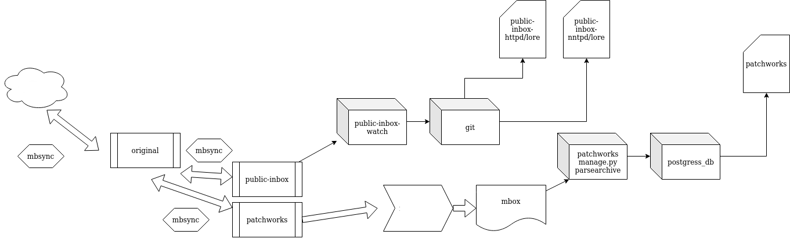

Flow
====

NOTE: Even though public-inbox CAN read from imap folders directly, I prefer a
backup and a controlled flow to avoid race if possible (lost email while trying
to clean up corporate imap folder due to space constraints etc..)

So, this does look a bit convoluted..



public-inbox config file
========================

public-inbox.config is actually file /data/public-inbox/config/config mapped over to /workdir/.public-inbox/config

you can create your own version of the file for example:
Example:

```
 public-inbox-init -V2 -L full --ng inbox.linux-patch-review --skip-artnum 1 --skip-epoch 1 "linux-patch-review" /git-repos/linux-patch-review.git http://example.com/lore/linux-patch-review/ linux-patch-review@example.com
```

This would initalize the git repos and make it ready to recieve emails, etc..
but will be missing many additional configurations that you may need to hand edit
in.. esp if you are handling emails from imap server.

mbsync config files
===================

* mbsyncrc.imap -> pulls email to a master maildir
* mbsyncrc.patchworks -> creates a copy from master maildir for patchwork
* mbsyncrc.public-inbox -> creates another copy from master maildir for public-inbox

Scripts
=======

* mbsync-cron.sh -> This runs all my  mail cleanup push pull etc sequences
  I use systemd to enable it, but cronjob will do just fine as well.
* [list-archive-maker](https://git.kernel.org/pub/scm/linux/kernel/git/mricon/korg-helpers.git/plain/list-archive-maker.py) - I use this to convert patchwork maildir to mbox and feed to patchworks:
```
      python manage.py parsearchive --list-id list@example.com /firefly/*.mbox
```

